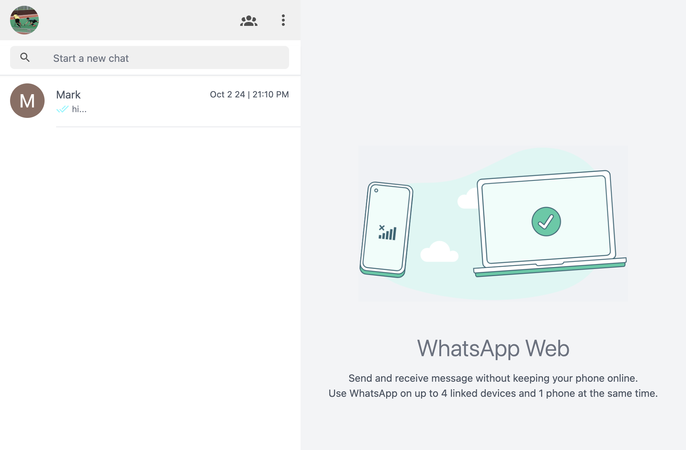
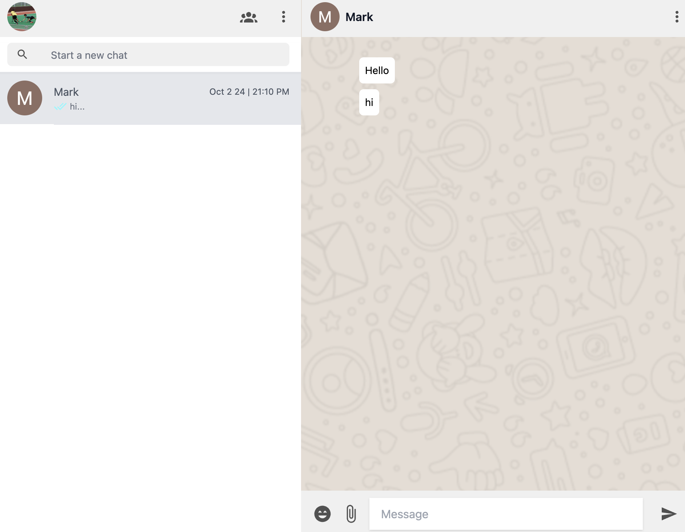

# WhatsApp Clone

A Full Stack WhatsApp Clone built using modern web technologies like Vue.js, Vite, Tailwind CSS, Node.js, Firebase, and Google Authentication.



## Features

- **Vue.js** for building the user interface.
- **Vite** as the frontend build tool for fast development.
- **Tailwind CSS** for modern and responsive UI styling.
- **Node.js** as the backend runtime.
- **Firebase** for real-time database, authentication, and storage.
- **Google Auth** integration for easy user authentication.



## Project Structure

- **Frontend**: Built using Vue.js with Vite and Tailwind CSS for the UI.
- **Backend**: A Node.js server to handle API requests.
- **Firebase**: Used for real-time database, authentication, and cloud storage.

## Installation

1. Clone the repository:

   ```bash
   git clone https://github.com/your-username/whatsapp-clone.git
2. Navigate to Project Directory
```
cd whatsapp-clone
```
3. Install Dependencies
```
npm install
```
4. Set up Firebase:
```
Create a Firebase project and enable authentication, Firestore, and storage.
Set up Google Authentication in Firebase.
Add your Firebase configuration to the project.
```
5. Run the development server
```
npm run dev (frontend)
npm run watch (backend)
```
## License

This project is licensed under the MIT License. See the [LICENSE](LICENSE) file for details.

# Vue 3 + Vite

This template should help get you started developing with Vue 3 in Vite. The template uses Vue 3 `<script setup>` SFCs, check out the [script setup docs](https://v3.vuejs.org/api/sfc-script-setup.html#sfc-script-setup) to learn more.

Learn more about IDE Support for Vue in the [Vue Docs Scaling up Guide](https://vuejs.org/guide/scaling-up/tooling.html#ide-support).
Here’s an example `README.md` file for your WhatsApp clone project:
